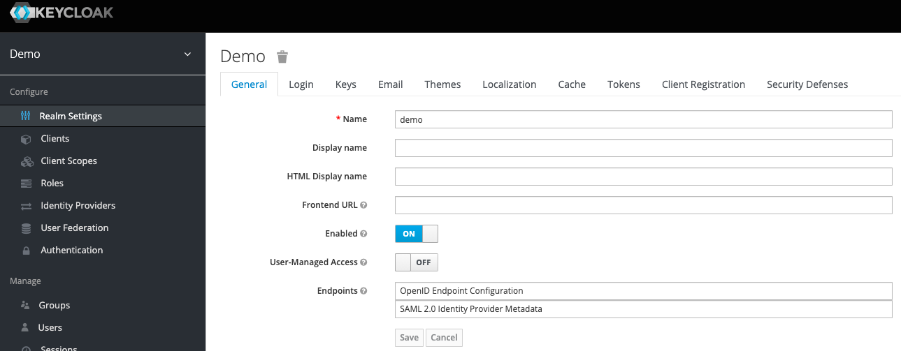
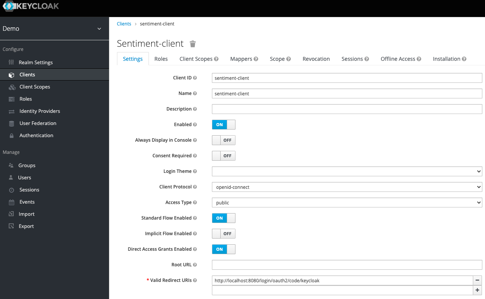
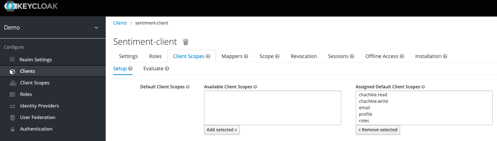
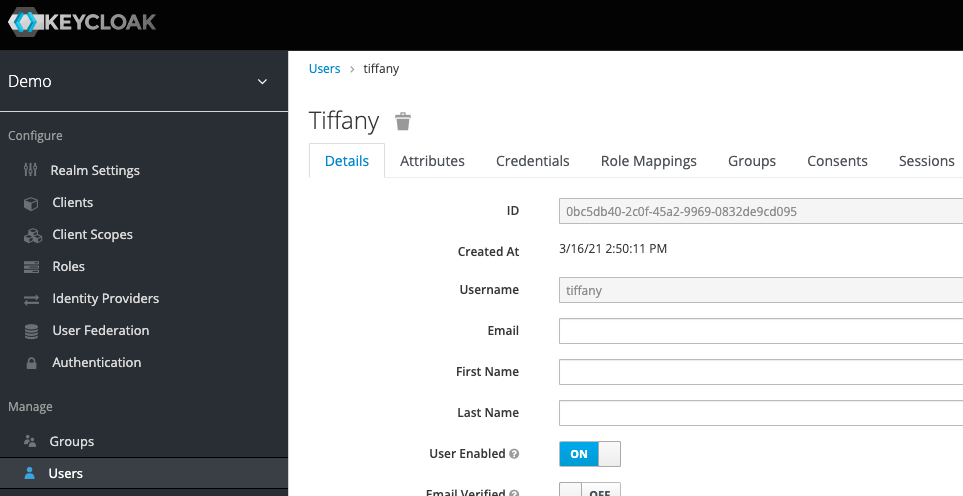

# This version uses Keycloak as Authorization Server

## Prerequisites

Add an entry to `/etc/hosts` file for identity provider hostname.

```
127.0.0.1       idp
```

## Start Keycloak server

```bash
kubectl create -f https://raw.githubusercontent.com/keycloak/keycloak-quickstarts/latest/kubernetes-examples/keycloak.yaml
```

Make sure all services are running.

```bash
watch kubectl get all 
```

Expose Keycloak port for access from localhost.

```bash
kubectl port-forward service/keycloak 8280:8080
```

## Configure Client Application

Login to [Keycloak Administration Console](http://localhost:8280) with `admin/admin` credentials.

Create a new Keycloak Realm called `demo`



Create a new client - `sentiment-client`



Create client scopes - `chachkie.read` and `chackie.write`.

Make sure that `sentiment-client` has above client scopes assigned



Create test user - `tiffany` with password `tanzu`



Start `ui` and `secure-chachkies` applications.

You should be able to login to [UI Application](http://localhost:8080) with `tiffany/tanzu` credentials.

## Resources:

[Josh Cummings Spring Security Cata](https://www.youtube.com/watch?v=P4TI1gLmr-4&ab_channel=VMwareTanzu)

[Josh's Repo](https://github.com/jzheaux/spring-security-tanzu-tuesday-november)

[Keycloak Kubernetes setup](https://www.keycloak.org/getting-started/getting-started-kube)